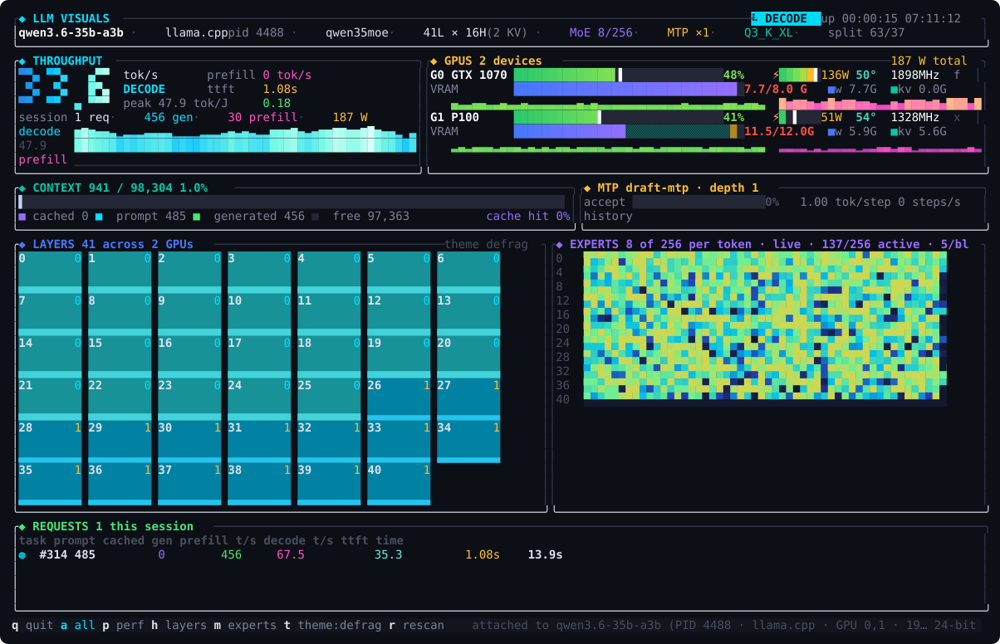
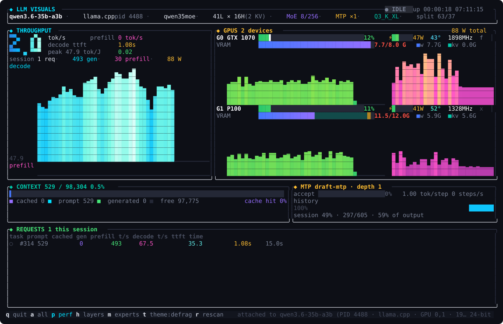
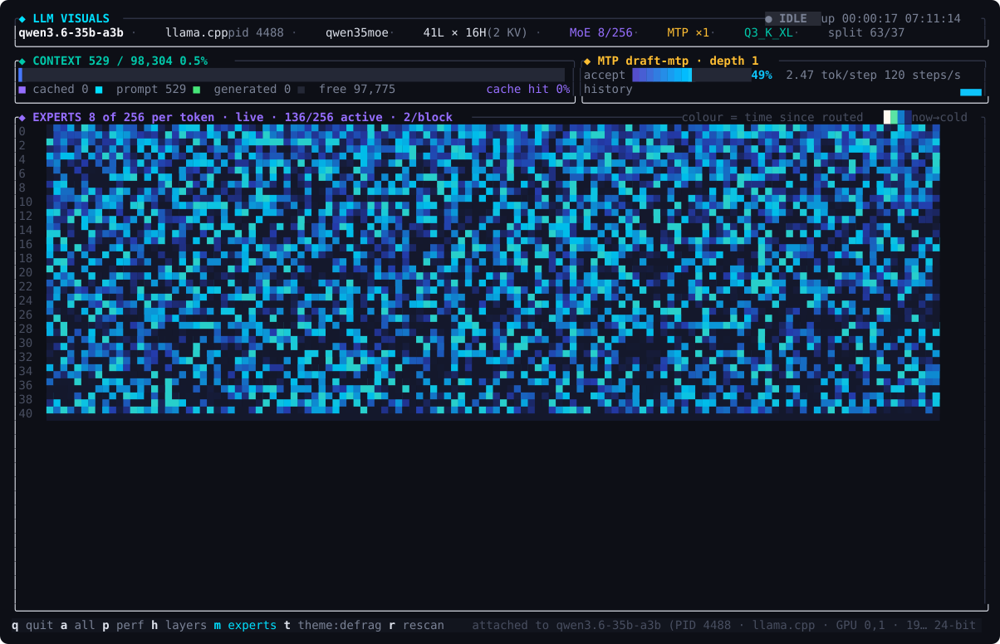
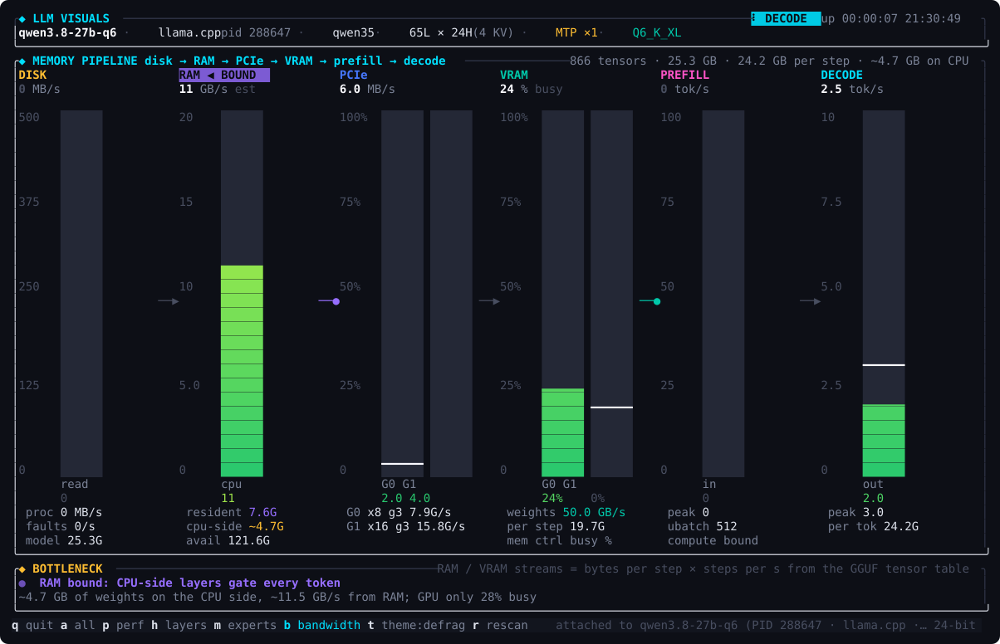

# llm-visuals

**A live terminal dashboard for the LLM running on your machine.**

It finds the inference server you already have up (llama.cpp `llama-server`,
ollama, vLLM, …), reads its counters and `nvidia-smi`, and turns them into a
truecolor picture of what the model is doing right now: tokens per second, time
to first token, GPU load and memory, context fill, speculative-decoding
acceptance, which layers are busy on which GPU, and, with a small server patch,
exactly which experts a mixture-of-experts model routed the last token through.

Every number on screen comes from the server, the driver, or arithmetic on
those. The one thing that can be a visual stand-in (expert identities without
the patch) is labelled as such on screen.



<sub>Live session, 140×44: Qwen3.6-35B-A3B (256 experts, MTP) on a GTX 1070 and
a Tesla P100 under llama.cpp, mid-request.</sub>

---

## Contents

- [Quick start](#quick-start)
- [What you see](#what-you-see)
- [Keys](#keys)
- [Where every number comes from](#where-every-number-comes-from)
- [Server setup: metrics and real expert routing](#server-setup-metrics-and-real-expert-routing)
- [Command-line options](#command-line-options)
- [Troubleshooting](#troubleshooting)
- [How it works](#how-it-works)
- [Contributing and license](#contributing-and-license)

---

## Quick start

Requirements: a Rust toolchain (1.75+), `nvidia-smi` on the path for GPU
panels, and a locally listening `llama-server` for throughput panels. Nothing
at all is needed for demo mode.

```sh
git clone https://github.com/DingoOz/llm-visuals
cd llm-visuals
cargo run --release -- --demo      # synthetic server + two synthetic GPUs
cargo run --release                # attach to the LLM server that is running
```

Or install the binary:

```sh
cargo install --path .
llm-visuals
```

The dashboard auto-detects the server: it lists GPU compute processes, scans
`/proc` for anything that looks like an inference engine, parses the command
line for the model path, port, context size and tensor split, and reads the
GGUF header for the architecture. Press `r` to rescan at any time.

---

## What you see

### Throughput



<sub>Performance zoom (`p`): tall history for decode and prefill rates, per-GPU
utilisation and power, and a longer request log.</sub>

Decode tokens/sec in large numerals, prefill tokens/sec, time to first token,
tokens per joule across all GPUs, session totals, and history sparklines.
Rates are computed over a one-second sliding window, which matters: speculative
decoders land tokens in bursts, and a per-poll rate flickers. On a test request
the server reported 24.3 tok/s and 412 ms prompt time; the dashboard showed
23.8 tok/s and a 0.38 s time to first token.

### GPUs

One card per device: utilisation gauge with a VU-style peak-hold notch, power
gauge, temperature coloured by heat, SM clock, fan, PCIe link, a VRAM bar split
into weights / KV in use / KV reserved / free, and utilisation and power
history sparklines.

### Context and MTP

The context bar shows cached, prompt and generated tokens against the window
with a pulsing head while the model works, plus cache-hit rate, KV cache types,
flash-attention and slot occupancy. Beside it the MTP panel shows speculative
decoding health: windowed acceptance rate, mean accepted tokens per
verification step, verification steps per second, an acceptance history and
session totals.

### Layers and experts



<sub>Expert zoom (`m`): one block per expert per layer, two experts per block at
this width, showing the router's real choices from `GET /experts`. Colour is
time since the expert was routed: white now, cooling to dark over about 0.6 s.</sub>

The layer panel draws one tile per transformer layer, tagged with the GPU it
lives on, coloured by that GPU's load with fast attack and slow release, each
carrying its own small history. The expert panel, for MoE models, draws one
block per expert per layer. With the server patch described below, the blocks
show the router's real choices and the title reads `live · N/256 active` (N is
the mean number of distinct experts each layer touched over its last 256
tokens). Without the patch the title reads `simulated`: the timing is real
(each new token re-routes every layer) but the identities are a stand-in.

### Memory pipeline

Press `b` for the bandwidth view: six VU-style channel strips, one per hop
the weights take on the way to a token, with an arrow animating between the
stages that are moving data and a verdict line naming the hop that is
holding the model back.



<sub>Bandwidth view (`b`): a dense 27B Q6 that leaves ~4.7 GB on the CPU.
GPUs under 40 % busy, memory controllers well under a quarter, and the
verdict names RAM as the bound at 2.5 tok/s.</sub>

| Stage | Meter | Source |
|---|---|---|
| DISK | MB/s read from every whole block device | `/proc/diskstats`, plus the server's own reads and major page faults from `/proc/<pid>/io` and `/proc/<pid>/stat` |
| RAM | GB/s of weights the CPU streams out of system RAM, *estimate* | CPU-side bytes × active fraction × steps/s; CPU-side bytes = GGUF size minus what the cards hold |
| PCIe | host→device MB/s per GPU, scaled to the link (gen × lanes) | `nvidia-smi dmon -s t` |
| VRAM | memory-controller busy % per GPU, plus the estimated GB/s of weights streamed | `nvidia-smi utilization.memory`; bytes per step from the GGUF tensor table |
| PREFILL | prompt tokens/s | `/slots` |
| DECODE | generated tokens/s | `/slots` |

"Bytes per step" is read straight from the GGUF tensor table: every tensor
except the embedding lookup, with `ffn_*_exps` tensors scaled by
`expert_used_count / expert_count`, so a 35B-A3B MoE reads ~2.7 GB per token
while a dense 27B Q6 reads ~24 GB. A step is one verification pass under
MTP / speculative decoding (from `/metrics`), one token otherwise, and one
micro-batch (`-ub`, default 512) during prefill. The verdict is a rule
chain: disk activity beats everything (weights are paging), then a PCIe link
past a third of its cap, then a memory controller past 75 %, then CPU-side
layers with an idle GPU, then a busy GPU (compute bound); otherwise no hop is
saturated and the gap is latency between tokens.

On a 27B Q6 model that does not quite fit two cards (~4.7 GB left on the
CPU), the view shows the GPUs under 40 % busy, memory controllers at 24 %,
and flags RAM as the bound at under 3 tok/s, which is what a CPU-offloaded
layer set feels like.

### Requests

One row per server task: prompt, cached and generated tokens, average prefill
and decode rates, time to first token and duration. The live request pulses.

---

## Keys

| Key | Action |
|-----|--------|
| `a` | full dashboard |
| `p` | performance zoom: tall sparklines, longer request log |
| `h` | layer tiles zoom |
| `m` | expert map zoom, finer blocks |
| `b` | memory pipeline: disk → RAM → PCIe → VRAM → prefill → decode VU meters and the bottleneck verdict |
| `t` | cycle theme: defrag, neon, fire, ocean, monochrome |
| `r` | rescan for a running server |
| `q` / `Esc` | quit |

Layouts adapt: below 26 rows the request log goes, below 20 the context and
MTP row goes, and on narrow terminals the GPU line sheds PCIe, fan, clock and
temperature before the gauge shrinks. Truecolor is auto-detected with a
256-colour fallback.

---

## Where every number comes from

| Metric | Source |
|---|---|
| decode tok/s | delta of `n_decoded` from `GET /slots`, 1 s sliding window |
| prefill tok/s | delta of `n_prompt_tokens_processed`, same window |
| time to first token | slot turning busy → first decoded token, quantised to the poll interval |
| tok/J | decode tok/s ÷ summed GPU power draw |
| cache hit | `n_prompt_tokens_cache / n_prompt_tokens` |
| request log | one record per `id_task`; averages from accumulated deltas |
| util, VRAM, power, °C, clocks, fan, PCIe | `nvidia-smi --query-gpu=…` every poll |
| VRAM weights vs KV | **estimate**: GGUF file size × `--tensor-split` share; the rest of used VRAM is shown as KV, because the driver cannot see inside the process |
| layers, heads, experts, MTP depth, quant | GGUF header of the model on the server's command line |
| layer → GPU | `--tensor-split` proportions |
| layer activity | utilisation of the GPU the layer lives on, smoothed |
| expert blocks | real top-k routing from `GET /experts` (patched server), else a deterministic stand-in keyed by layer and token step |
| MTP acceptance, tok/step, steps/s | deltas of `spec_decode_num_draft_tokens_total`, `…accepted_tokens_total`, `…drafts_total` from `GET /metrics`, 1.5 s window |
| disk MB/s, faults/s | deltas of sectors read in `/proc/diskstats` (whole disks), `read_bytes` in `/proc/<pid>/io`, `majflt` in `/proc/<pid>/stat` |
| resident weights | `RssFile` in `/proc/<pid>/status` |
| PCIe MB/s | `nvidia-smi dmon -s t -c 1` rx/tx per GPU; samples above the link cap are dropped (dmon emits the odd garbage row) |
| VRAM busy % | `utilization.memory` from `nvidia-smi` (memory-controller busy time) |
| bytes per step, RAM / VRAM GB/s | **estimate**: GGUF tensor table (sizes from offset gaps), expert tensors × used/total, split CPU vs GPU by what the cards hold, × steps/s |

Per-request `timings` only appear inside completion responses, which the
dashboard never sees, so everything is reconstructed from polled counters.

---

## Server setup: metrics and real expert routing

Throughput and context work with any llama-server. Two panels need more:

**MTP / speculative acceptance** needs the Prometheus endpoint:

```sh
llama-server ... --metrics          # or env LLAMA_ARG_ENDPOINT_METRICS=1
```

**Real expert routing** needs a small patch to llama.cpp, included in
[`patches/`](patches/README.md). Stock llama.cpp computes the router's top-k
choices in every MoE layer but never exports them; the patch adds an
`--expert-stats` flag and a `GET /experts` endpoint.

```sh
cd /path/to/llama.cpp
git apply /path/to/llm-visuals/patches/llama-server-expert-stats.patch
cmake --build build --target llama-server -j
llama-server ... --metrics --expert-stats   # or env LLAMA_ARG_EXPERT_STATS=1
```

For a systemd unit, a drop-in with two `Environment=` lines is enough; see
[`patches/README.md`](patches/README.md). The dashboard probes both endpoints
at start and after `r`, and stops asking after three failures, so unpatched
servers cost nothing.

---

## Command-line options

```
--demo               synthetic server and GPUs; exercises every panel
--model <id|auto>    `auto` (default) observes the running server;
                     an HF id streams real attention via the Python bridge
--gpu 0,1            nvidia-smi indices to show (default: all)
--poll-ms 200        sampling interval for the server and nvidia-smi
--color auto|truecolor|256
--theme defrag|neon|fire|ocean|monochrome
--max-layers N, --max-heads N     caps for the attention view
```

`llm-visuals --help` lists everything.

---

## Troubleshooting

**"no inference server detected".** The server must be a local process; the
detector looks for `llama-server`, `ollama`, `vllm`, `sglang`, `exllama`,
`text-generation` and similar names, or a `--model` flag. Start it, then press
`r`.

**GPU panel says "Driver/library version mismatch".** `nvidia-smi` itself is
failing: the NVIDIA userspace was upgraded under a running kernel module.
Reload the modules or reboot. The panel shows whatever `nvidia-smi` prints so
the cause is visible.

**MTP panel says "start llama-server with --metrics".** Exactly that; see
above.

**Expert panel says "simulated".** The server does not serve `/experts`. Apply
the patch, rebuild, restart with `--expert-stats`, then press `r`.

**Expert panel says "dense model".** The GGUF has no `expert_count`; there is
nothing to route.

**Colours look flat.** Your terminal did not advertise truecolor. Run with
`--color truecolor`, or export `COLORTERM=truecolor`.

**PCIe strip says "nvidia-smi dmon unavailable".** The driver does not
report PCIe counters for this card, or `dmon` failed three times in a row;
the other stages still work. Press `r` to retry.

**RAM strip says "no tensor table".** The model path on the server's command
line could not be opened as a GGUF (ollama blobs, remote paths, or a
non-GGUF engine). Disk, PCIe and VRAM meters still work; the byte estimates
need the file.

**Throughput reads zero while the model is clearly working.** Another client
may be using a different slot; the dashboard follows the busy slot when there
is one. Check `GET /slots` on the server.

---

## How it works

`docs/ARCHITECTURE.md` has the module map and data contracts. In short:
pollers on tokio tasks read `/slots`, `/metrics`, `/experts`, `nvidia-smi`
and the host's `/proc` counters every 200 ms into channels; the frame loop drains them into a `PerfTracker`
(sliding-window rates, request lifecycle, peak hold) and a `FadeState`
(attack/release smoothing, expert heat), then renders with ratatui at about
30 fps. Tests cover every parser against captured real payloads.

```
src/
├── main.rs          event loop, pollers, key handling
├── render.rs        panels, gauges, sparklines, big digits
├── perf.rs          rates, TTFT, request records, MTP stats, VU meters
├── bandwidth.rs     weight layout and the bottleneck verdict
├── host.rs          /proc disk, faults, RSS; nvidia-smi dmon PCIe
├── fade.rs          smoothing and expert heat
├── observe.rs       /slots, /metrics, /experts parsers
├── gpu.rs           nvidia-smi collector, demo GPUs
├── model_detect.rs  finds the server, parses its command line
├── gguf.rs          GGUF header reader, layer → GPU mapping
├── demo.rs          synthetic server for --demo
├── colors.rs        palette, gradients, truecolor/256 gating
└── llm/             optional HF transformers attention bridge
patches/             llama.cpp patch for GET /experts
docs/                architecture, roadmap, screenshots
```

---

## Contributing and license

Issues and pull requests are welcome; see [CONTRIBUTING.md](CONTRIBUTING.md)
for the principles (real numbers only, degrade gracefully, smooth not flicker)
and the checklist. MIT licensed, see [LICENSE](LICENSE).
